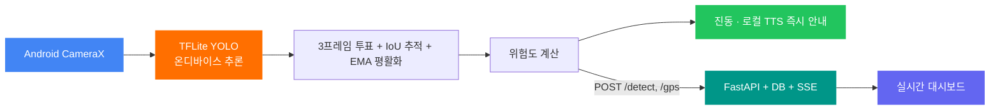
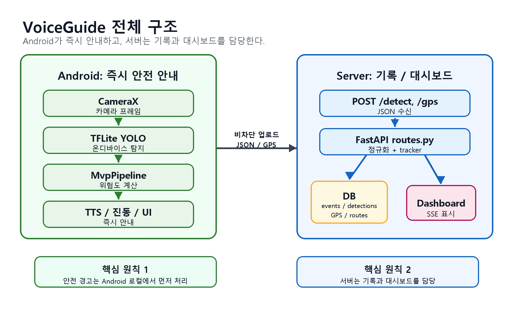

<div align="center">

# VoiceGuide

**시각장애인을 위한 온디바이스 AI 보행 보조 앱**

스마트폰 카메라로 전방 장애물을 실시간 탐지하고  
**진동, 한국어 음성 안내, 실시간 대시보드**로 보행 상황을 지원합니다.

[](https://python.org)
[](https://developer.android.com)
[](https://fastapi.tiangolo.com)
[](https://cloud.google.com/run)

[라이브 대시보드](https://voiceguide-1063164560758.asia-northeast3.run.app/dashboard) ·
[GitHub](https://github.com/coding-jhj/VoiceGuide)

</div>

---

## 목차

- [한눈에 보기](#한눈에-보기)
- [주요 기능](#주요-기능)
- [현재 구현 상태](#현재-구현-상태)
- [공공데이터 활용 시나리오](#공공데이터-활용-시나리오)
- [프로젝트 구조](#프로젝트-구조)
- [빠른 시작](#빠른-시작)
- [환경 변수](#환경-변수)
- [테스트](#테스트)
- [배포](#배포)
- [주요 API](#주요-api)
- [관련 문서](#관련-문서)

---

## 한눈에 보기

VoiceGuide는 카메라 이미지를 서버로 보내지 않고, **Android 기기 안에서 YOLO/TFLite 모델로 장애물을 감지**합니다. 앱은 위험도에 따라 진동 패턴과 한국어 TTS를 즉시 출력하고, 서버는 탐지 JSON과 GPS를 받아 대시보드, 이력, 경로, 공공데이터 시나리오를 시각화합니다.

| 핵심 가치 | 구현 방식 |
|---|---|
| 개인정보 보호 | 카메라 프레임은 기기 내부에서만 추론하고 서버로 전송하지 않음 |
| 즉시 안내 | Android 로컬 `SentenceBuilder`가 TTS 문장을 생성해 서버 응답을 기다리지 않음 |
| 보행 안전 | 장애물 위험도에 따라 `NONE`, `SHORT`, `DOUBLE`, `URGENT` 진동 패턴 제공 |
| 설명 가능한 데이터 | 사고다발구역, 횡단보도 접근성, 보행지원시설 근거를 대시보드에 표시 |

```text
Android CameraX
  -> TFLite YOLO 온디바이스 추론
  -> 3프레임 투표 필터 + IoU 추적 + EMA 평활화
  -> 위험도 계산
  -> 진동 / 로컬 TTS 즉시 안내
  -> POST /detect, /gps
  -> FastAPI + DB + SSE
  -> 실시간 대시보드
```



<div align="center">
  
</div>

---

## 주요 기능

| 영역 | 기능 |
|---|---|
| 온디바이스 AI | 카메라 프레임은 기기 내부에서만 추론하며 서버로 전송하지 않습니다. |
| 커스텀 모델 | COCO 80개 클래스에 계단, 문 등 보행 위험 요소를 보강했습니다. |
| 위험 선행 알림 | 긴급 위험 감지 시 진동/비프음을 먼저 출력하고 음성 안내를 이어갑니다. |
| 찾기 모드 | “의자 찾아줘”, “가방 어디 있어”처럼 대상 물체의 방향과 거리를 안내합니다. |
| 주변 확인 | “지금 뭐가 있어?” 요청에 현재 프레임과 최근 추적 상태를 요약합니다. |
| 공공데이터 지도 | 사고다발구역, 횡단보도 접근성, 보행지원시설 근거를 대시보드에 표시합니다. |

### 앱 모드

| 모드 | 음성 예시 | 동작 |
|---|---|---|
| 장애물 | “앞에 뭐 있어”, “길 어때” | 위험도 상위 장애물을 즉시 안내 |
| 찾기 | “의자 찾아줘”, “가방 어디 있어” | 찾는 물체의 방향과 거리 안내 |
| 주변 확인 | “지금 뭐가 있어”, “현재 상황 알려줘” | 현재 프레임과 최근 tracker 상태 요약 |
| 물건 확인 | “손에 든 게 뭐야”, “바로 앞 뭐야” | 가까운 물체를 우선 답변 |

---

## 현재 구현 상태

| 기능 | 상태 | 설명 |
|---|---:|---|
| 장애물 탐지 | 완료 | `yolo11n_320.tflite` 기반 온디바이스 추론 |
| 위험도 진동 | 완료 | `NONE`, `SHORT`, `DOUBLE`, `URGENT` 패턴 |
| 한국어 TTS | 완료 | 화면 없이 상황별 안내 문장 발화 |
| 음성 명령 모드 | 완료 | 장애물, 찾기, 주변 확인, 물건 확인 |
| 서버 전송 / DB 저장 | 완료 | 탐지 JSON, GPS, 최근 상태 저장 |
| 실시간 대시보드 | 완료 | 탐지 현황, 경로, 24시간 내역, 사고다발구역 |
| 오프라인 보조 안내 | 완료 | 서버 없이 Android 내장 TTS와 진동 유지 |
| 공공데이터 시나리오 | 완료 | 보라매역 -> 서울시남부장애인종합복지관 경로 비교 |

---

## 공공데이터 활용 시나리오

최종 발표/데모용 데이터는 `data/processed/voiceguide_final/`에 있습니다. 대표 시나리오는 **보라매역에서 서울시남부장애인종합복지관까지 이동할 때, 단순 최단 경로보다 보행지원시설 근거가 있는 경로를 선택하는 흐름**입니다.

### 활용한 공공데이터 항목

| 데이터 항목 | README/대시보드에서 쓰는 역할 |
|---|---|
| 횡단보도 위치 데이터 | 동작구 횡단보도 후보를 지도 포인트와 경로 비교 기준점으로 사용 |
| 보행등/교통신호 정보 | 횡단 가능 신호 안내의 근거로 사용 |
| 음향신호기 정보 | 시각장애인 보행 안내에 중요한 안전 시설 여부로 점수화 |
| 보행자작동신호기 정보 | 사용자가 직접 신호를 요청할 수 있는 시설 여부로 점수화 |
| 고원식 횡단보도 정보 | 차량 감속과 보행자 보호 가능성을 나타내는 보조 점수로 사용 |
| 교통안전시설 상세 정보 | 횡단보도별 설명 가능한 안전 근거로 사용 |
| 보행자 사고다발구역 | 대시보드 지도에서 주의 구역 레이어로 표시 |
| 장애인 복지시설/목적지 후보 | 데모 목적지와 접근성 시나리오 구성에 사용 |
| 이동지원센터 후보 | 목적지 접근성 설명과 fallback 안내 후보로 사용 |

### 데이터 처리 흐름

```text
원본 공공데이터
  -> 목적지 / 횡단보도 / 보행지원시설 / 이동지원센터 분리
  -> 좌표 정규화
  -> 횡단보도 주변 30m 시설 매칭
  -> 보행등, 음향신호기, 작동신호기, 고원식, 상세정보 점수화
  -> preferred / recommended / basic / insufficient 등급화
  -> 대시보드용 CSV, GeoJSON, JSON, HTML 산출
```

| 파일 | 용도 |
|---|---|
| `final_route_comparison.csv` | 보라매역 -> 서울시남부장애인종합복지관 A/B 경로 비교 |
| `final_scenario_dataset.json` | 대시보드가 읽는 대표 시나리오 JSON |
| `final_crosswalk_accessibility.csv` | 동작구 횡단보도 접근성 점수표 |
| `final_crosswalk_accessibility.geojson` | 지도 레이어용 횡단보도 포인트 |
| `final_tts_guidance.csv` | 발표/앱 안내 문장 |
| `final_data_usage_refined.html` | 데이터 활용 근거 설명 HTML |

대표 시나리오는 최단 후보 A(`06-0000016344`)보다 보행등, 음향신호기, 보행자작동신호기 근거가 있는 B(`06-0000032157`)를 선택하는 흐름입니다. 대시보드에서는 이 결과를 경로 카드, 접근성 등급, 보강 제안 지점, 데이터 활용 근거 링크로 표시합니다.

> 현재 A/B 경로의 거리는 지도 경로 API 기반 실제 보행 네트워크 거리가 아니라 대표 횡단보도 경유 직선거리 합 기반 데모값입니다. 발표에서는 “공공데이터 기반 시나리오 데이터”로 설명하고, 실제 최단 보행거리 검증은 다음 단계로 분리합니다.

재생성:

```bash
python tools/build_voiceguide_final_dataset.py
```

---

## 프로젝트 구조

```text
VoiceGuide/
├── android/app/src/main/
│   ├── assets/
│   │   ├── yolo11n_320.tflite
│   │   ├── yolo26n_float32.tflite
│   │   └── policy_default.json
│   └── java/com/voiceguide/
│       ├── MainActivity.kt
│       ├── TfliteYoloDetector.kt
│       ├── MvpPipeline.kt
│       ├── SentenceBuilder.kt
│       ├── VoiceGuideConstants.kt
│       ├── VoicePolicy.kt
│       └── Detection.kt
│
├── src/
│   ├── api/
│   │   ├── main.py
│   │   ├── routes.py
│   │   ├── db.py
│   │   ├── tracker.py
│   │   └── events.py
│   ├── nlg/
│   │   ├── sentence.py
│   │   └── templates.py
│   └── config/
│       ├── policy.json
│       └── policy.py
│
├── templates/dashboard.html
├── data/processed/voiceguide_final/
├── docs/
│   ├── reports/
│   │   ├── current_status.html
│   │   └── model_tuning_issue.html
│   └── status/
├── tools/
│   ├── build_voiceguide_final_dataset.py
│   └── build_business_plan.js
├── tests/
├── Dockerfile
├── package.json
└── requirements.txt
```

---

## 빠른 시작

### 서버 실행

```bash
pip install -r requirements.txt
cp .env.example .env
uvicorn src.api.main:app --host 0.0.0.0 --port 8000
```

서버에는 YOLO 모델이 필요하지 않습니다. 모델 추론은 Android 기기에서 수행합니다.

### Android 앱 실행

1. Android Studio에서 `android/` 폴더 열기
2. Gradle Sync
3. USB 기기 연결 및 USB 디버깅 활성화
4. Run (`Shift+F10`)
5. 앱 설정에서 서버 URL 입력

```powershell
cd android
.\gradlew.bat assembleDebug
```

---

## 환경 변수

| 변수 | 기본값 | 설명 |
|---|---|---|
| `DATABASE_URL` | SQLite | PostgreSQL/Supabase 연결 URL |
| `API_KEY` | 없음 | Bearer 또는 `X-API-Key` 인증 |
| `PORT` | `8000` | 서버 포트 |

---

## 테스트

```bash
python -m pytest tests/ -v -m "not integration"
```

최종 공공데이터/API 검증:

```bash
python -m pytest tests/test_api.py tests/test_voiceguide_final_dataset.py
```

---

## 배포

현재 Cloud Run 서비스:

```text
https://voiceguide-1063164560758.asia-northeast3.run.app
```

주요 화면:

```text
GET /health
GET /dashboard
GET /voiceguide-final/summary
GET /voiceguide-final/crosswalks.geojson
GET /voiceguide-final/data-usage.html
```

배포 예시:

```powershell
cd C:\VoiceGuide\VoiceGuide
gcloud run deploy voiceguide --source . --region asia-northeast3 --project project-d9b26ccb-c174-4820-b16
```

---

## 주요 API

| 메서드 | 경로 | 설명 |
|---|---|---|
| `POST` | `/detect` | 탐지 결과 JSON 수신, DB 저장, tracker 업데이트 |
| `POST` | `/detect_json` | 구형 호환 탐지 JSON 수신 |
| `POST` | `/question` | 최근 tracker/DB 상태 기반 주변 확인 응답 |
| `POST` | `/gps` | Android 위치 업데이트 |
| `GET` | `/api/policy` | Android 정책 동기화, ETag 캐싱 |
| `GET` | `/status/{session_id}` | 세션 현재 상태 |
| `GET` | `/events/{session_id}` | SSE 실시간 스트림 |
| `GET` | `/history/{session_id}` | 세션별 탐지 이력 |
| `GET` | `/heatmap/{session_id}` | 위험 히트맵 |
| `GET` | `/routes/{session_id}` | 저장된 GPS 경로 |
| `GET` | `/pedestrian-hotspots/nearby` | GPS 기반 보행자 사고다발구역 |
| `GET` | `/voiceguide-final/summary` | 최종 시나리오 요약 |
| `GET` | `/voiceguide-final/crosswalks.geojson` | 횡단보도 접근성 GeoJSON |
| `GET` | `/voiceguide-final/data-usage.html` | 데이터 활용 근거 HTML |
| `GET` | `/dashboard` | 실시간 대시보드 |

---

## 관련 문서

| 문서 | 위치 | 내용 |
|---|---|---|
| 현재 상황 보고서 | `docs/reports/current_status.html` | 시스템 아키텍처, 핵심 이슈, 서버 엔드포인트, 로드맵 |
| 모델 튜닝 이슈 분석 | `docs/reports/model_tuning_issue.html` | 파인튜닝 모델 오인식 원인과 개선 방향 |
| 디버그 리포트 | `docs/debug_report.md` | 서버, 트래커, 대시보드 디버깅 기록 |
| 상태 보고서 | `docs/status/CURRENT_STATUS_REPORT.md` | Markdown 기반 프로젝트 상태 요약 |
| 최종 데이터 설명 | `data/processed/voiceguide_final/README.md` | 최종 공공데이터 산출물 기준과 주의사항 |

---

<div align="center">

**AI HUMAN 4기 3팀 · 2026**

</div>
